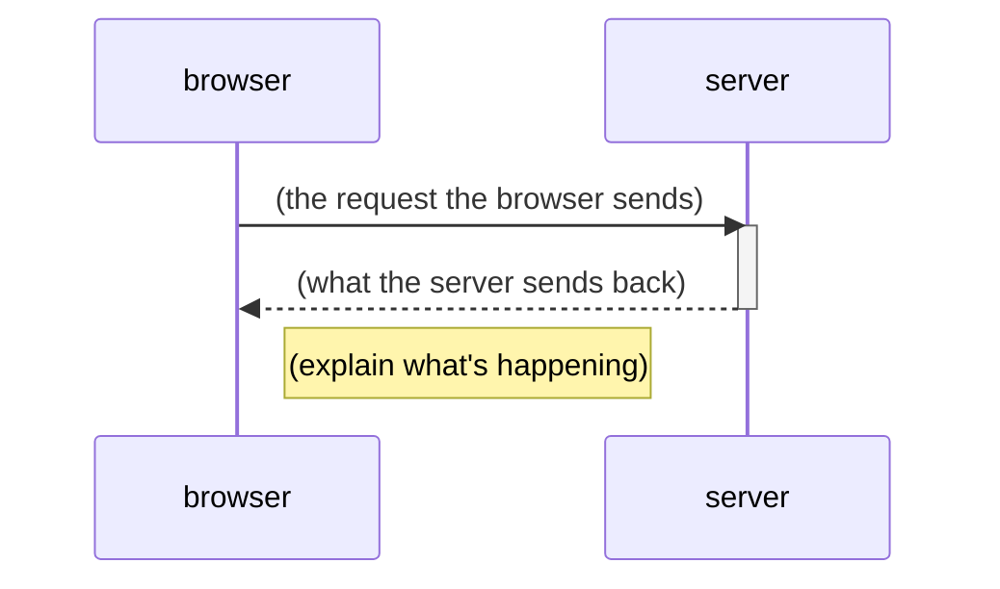

```mermaid
sequenceDiagram
    participant browser
    participant server

    browser->>server: (the request the browser sends)
    activate server
    server-->>browser: (what the server sends back)
    deactivate server

    Note right of browser: (explain what's happening)
```
